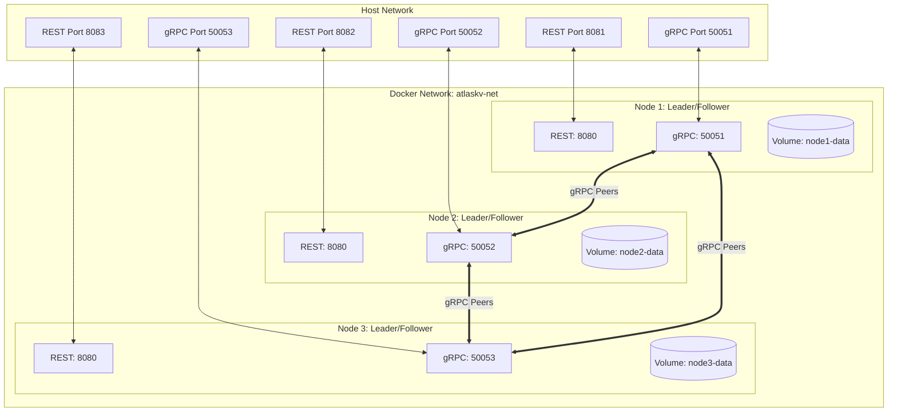

# AtlasKV Docker & Clustering Guide

This guide provides instructions on building, running, verifying, and managing AtlasKV in a production-ready, containerized 3-node Raft consensus cluster using Docker and Docker Compose.

---

## 1. Architecture Diagram



---

## 2. Prerequisites

Ensure the following tools are installed on your machine:
*   [Docker](https://www.docker.com/get-started) (v20.10.0 or higher)
*   [Docker Compose](https://docs.docker.com/compose/install/) (v2.0.0 or higher)
*   [Git](https://git-scm.com/)

No local Java SDK, Maven, or IDE dependencies are required to run the cluster.

---

## 3. Ports Configuration

Each node exposes a REST API for clients and a gRPC interface for Raft peer communication:

| Node Service Name | Host REST Port | Host gRPC Port | Internal REST Port | Internal gRPC Port | Healthcheck Endpoint |
| :--- | :--- | :--- | :--- | :--- | :--- |
| **`node1`** | `8081` | `50051` | `8080` | `50051` | `http://localhost:8080/api/v1/cluster/status` |
| **`node2`** | `8082` | `50052` | `8080` | `50052` | `http://localhost:8080/api/v1/cluster/status` |
| **`node3`** | `8083` | `50053` | `8080` | `50053` | `http://localhost:8080/api/v1/cluster/status` |

---

## 4. Environment Variables

The AtlasKV container image is highly configurable via standard environment variables:

| Variable | Description | Default Value | Example for Node 2 |
| :--- | :--- | :--- | :--- |
| `NODE_ID` | Unique identifier for the Raft node | `node1` | `node2` |
| `REST_PORT` | Port where the Spring Boot REST API listens | `8080` | `8080` |
| `GRPC_PORT` | Port where the gRPC Raft consensus engine listens | `50051` | `50052` |
| `DATA_DIRECTORY` | Location where write-ahead logs, metadata, and snapshots are saved | `/app/data` | `/app/data` |
| `PEER_NODES` | Comma-separated list of peer identities and their addresses (`id:host:port`) | `""` | `node1:node1:50051,node2:node2:50052,node3:node3:50053` |
| `LOG_LEVEL` | Logging verbosity for com.atlaskv packages (`TRACE`, `DEBUG`, `INFO`, `WARN`, `ERROR`) | `INFO` | `INFO` |

---

## 5. Startup & Shutdown Commands

### Build Image
To build the production-ready AtlasKV multi-stage image manually:
```bash
docker build -t atlaskv:latest .
```

### Start the Cluster
To build the images and launch the full 3-node cluster in the background:
```bash
docker compose up -d --build
```
This single command automates the entire process: compiles the codebase using a temporary builder JDK container, packages the minimal JRE runtime image, establishes the bridge network, creates persistent volumes, and bootstraps the cluster.

### View Cluster Logs
To inspect live logs from all nodes in real time:
```bash
docker compose logs -f
```
Or view logs for a specific node:
```bash
docker compose logs -f node1
```

### Shut Down the Cluster
To gracefully stop the running cluster containers (without losing data):
```bash
docker compose down
```

### Reset Cluster State (Wipe Data)
To completely stop the cluster and delete all persistent volumes (e.g. to start with a fresh blank database):
```bash
docker compose down -v
```

---

## 6. Persistent Volumes & Storage

AtlasKV persists its files under the `/app/data` directory inside the container, which is bound to dedicated local named volumes:
*   `node1-data` -> Mounted to `/app/data` on `node1`
*   `node2-data` -> Mounted to `/app/data` on `node2`
*   `node3-data` -> Mounted to `/app/data` on `node3`

Inside each volume, the directory structure is managed dynamically:
*   `/app/data/storage/node-id`: Stores the persistent node identifier, ensuring storage directories cannot be accidentally swapped or misconfigured.
*   `/app/data/storage/raft.wal`: Write-Ahead Log storing all cluster commands.
*   `/app/data/storage/raft.meta`: Stores persistent consensus state (`currentTerm`, `votedFor`).
*   `/app/data/snapshots/`: Directory where the engine saves periodic state snapshots.

All write-ahead logs, snapshots, and node metadata survive container restarts and updates.

---

## 7. Startup Verification Checklist

Once the cluster is up, perform the following validation steps:

### 1. Verify Container Health
Check the health status of all three nodes. Docker will show them as `healthy` once the Spring Boot application starts and completes its initial Raft bootstrapping.
```bash
docker compose ps
```

### 2. Verify Leader Election
Query any node to see who is the current elected Leader. A quorum of active nodes (at least 2) is required to successfully elect a leader.
```bash
curl -s http://localhost:8081/api/v1/cluster/leader
```
*Expected Output:*
```json
{"leaderId":"node1","leader":true,"term":1}
```

### 3. Verify Cluster Membership
Query the list of active members inside the Raft group:
```bash
curl -s http://localhost:8081/api/v1/cluster/members
```
*Expected Output:*
```json
{"members":["node1","node2","node3"],"joint":false,"oldMembers":[],"newMembers":[],"leaderId":"node1"}
```

### 4. Perform Key-Value Write
Send a key-value pair write command to the cluster leader (e.g., node1 on port 8081):
```bash
curl -X POST http://localhost:8081/api/v1/kv \
  -H "Content-Type: application/json" \
  -d '{"key": "user_id", "value": "usr_98765"}'
```
*Expected Output:*
```json
{"success":true,"message":"Key-value pair set successfully"}
```

### 5. Perform Key-Value Read (Consensus Replication Verify)
Query one of the followers (e.g., node2 on port 8082 or node3 on port 8083) to verify that the value was replicated instantly:
```bash
curl -s http://localhost:8082/api/v1/kv/user_id
```
*Expected Output:*
```json
{"key":"user_id","value":"usr_98765"}
```

---

## 8. Troubleshooting & Diagnostics

### Port Conflict Error
If you receive an error like `bind: address already in use` for ports `8081`, `8082`, `8083` or `50051`, `50052`, `50053`, ensure you do not have any local database engines or previous AtlasKV processes running on those ports. Stop them and retry.

### Identity Mismatch on Restart
If you change the `NODE_ID` in the `docker-compose.yml` but keep the same mounted volume, the node will fail to start and throw `NodeLifecycleException: Node identity mismatch`. This safety check prevents data corruption. To resolve, either revert the ID change or reset the volumes with `docker compose down -v`.

### Node Unhealthy status
If a node is marked as `unhealthy` in `docker compose ps`, inspect the logs using `docker compose logs <node-name>` to see the exact exception. Usually, this is caused by network partition issues (such as firewall blocks or Docker network interface failures) preventing gRPC peer connections.
